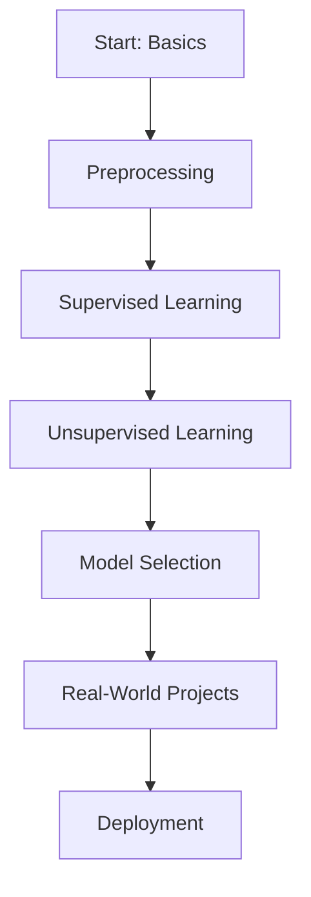

<h1 align="center">🚀 ML-Mastery: Master Machine Learning from Scratch to Deployment</h1>

<p align="center">
  
  
  
</p>

---

## 📌 What is ML-Craft?

**ML-Craft** is a one-stop, beginner-to-advanced Machine Learning repository that teaches you all essential concepts—from data preprocessing to model deployment. It’s built to help:

-Beginners understand core ML techniques  


---

## 📁 Repository Structure

```bash
ML-Craft/
│
├── README.md                 # Project Overview
├── 00_Basics/               # Python, NumPy, Pandas, Math & Stats
├── 01_Preprocessing  /      # Missing values, encoding, scaling
├── 02_Supervised_Learning/  # Regression, Classification algorithms
├── 03_Unsupervised_Learning/ # Clustering, Dimensionality Reduction
├── 04_Model_Selection_Tuning/ # Cross-validation, Grid/Random Search
├── 05_Project_Templates/    # Clean project structures
├── 06_Real_World_Projects/  # End-to-end case studies
├── 07_Deployment/           # Flask, Streamlit, FastAPI, CI/CD
├── 08_Resources/            # Books, Blogs, Cheat Sheets
└── LICENSE
```

